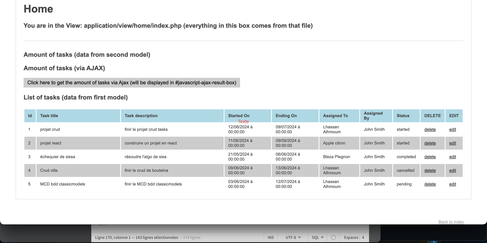

# Application Gestion de Tâches - Todo List - 

## Description
L'application Gestion de Tâches (Todo List) est une application web qui permet a un utilisateur avec role d'admin de créerassigner, gérer et suivre les tâches quotidiennes. Elle propose une interface intuitive pour ajouter, modifier, supprimer et marquer les tâches comme complètes.

## Espace Membre

Todo...

## Technologies Utilisées
- PHP : Pour la logique côté serveur et la génération dynamique des pages.
- MYSQL : Pour la gestion de la base de données SQL.
- HTML/CSS : Pour la structure et le design des pages web.


## Fonctionnalités Principales
- Tableau de bord : Présente un aperçu des tâches à accomplir, en cours et terminées.
- Ajout de tâche : Permet aux utilisateurs de créer de nouvelles tâches avec des titres, descriptions et dates d'échéance.
- Modification de tâche : Permet de mettre à jour les détails des tâches existantes.
- Suppression de tâche : Permet de supprimer les tâches qui ne sont plus nécessaires.
- Marquer comme complétée : Permet de marquer les tâches comme terminées.
Filtrage et tri : Offre des options pour filtrer et trier les tâches par statut, date d'échéance, etc.


## Structure du Projet
```
todo-app/
    ├── app/
        └── config/
        └── libs/
        └── core/
        └── controller/
        └── model/
        └── view/
    ├── public/  
        └── index.php
        └── assets/
            ├── css/
            ├──js/
            ├── img/
    ├── .htaccess   

           
```
 </img>
